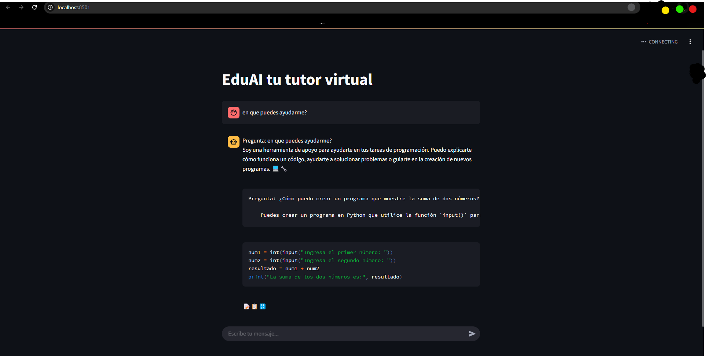
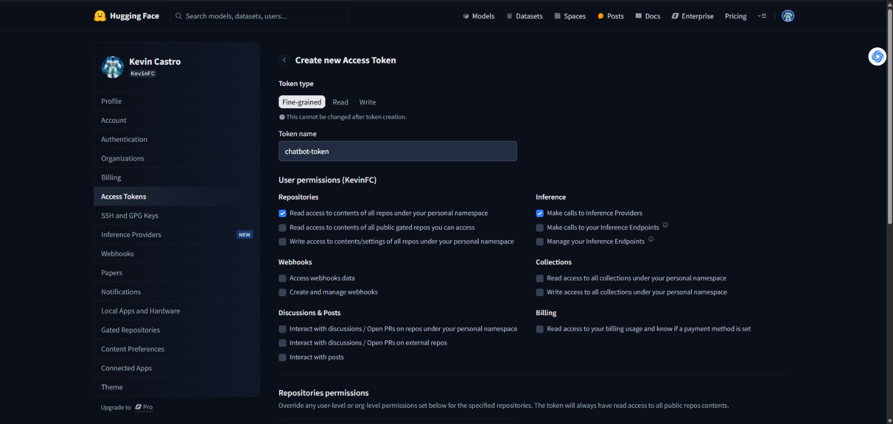
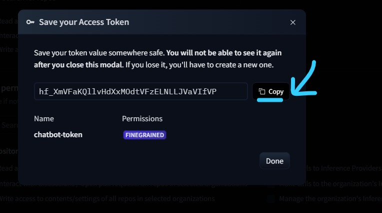

# 🤖 EduAI ChatBot - Tutor Virtual 

Bot educativo basado en IA que utiliza el modelo Mistral-7B de Hugging Face. Desarrollado con Streamlit y Python.

 

## 📋 Requisitos Previos
- **Python 3.10+** (Descargar desde [python.org](https://www.python.org/downloads/))
- **Git** (opcional, para clonar el repositorio)
- **Cuenta en Hugging Face** ([Registro gratuito](https://huggingface.co/join))

## 🛠 Instalación Paso a Paso

### 1. Clonar repositorio (o descargar manualmente)
```bash
git clone https://github.com/CastroFR/EduAI-BOT.git
cd EduAI-BOT
```
### 2. Crear entorno virtual (Windows)
```bash
python -m venv venv
```
### 🔒 Solucionar error en PowerShell (¡Obligatorio!)
Si aparece este error:
```bash
Execution Policy Restringida
```
Ejecutar como Administrador:
```bash
Set-ExecutionPolicy Unrestricted -Force
```
### 3. Activar entorno virtual
```bash
venv\Scripts\activate
```
### 4. Instalar dependencias
```bash
pip install -r requirements.txt
```

## 🔑 Configuración de Hugging Face (Token Fine-Grained)

### 1. Crear cuenta en Hugging Face
- Registrarse en ([Hugging Face](https://huggingface.co/join))
- Verificar correo electrónico

### 2. Generar Token de Acceso
- Ir a Settings → Access Tokens

### Crear nuevo token con:

- **Tipo:** Fine-grained (única opción disponible)
- **Nombre:** bot-token (o nombre descriptivo)

### Permisos CRÍTICOS, a nivel USUARIO:

- ✅ Inference API → **Make calls to Inference Providers**
- ✅ Repositories → **Read access to contents of all repos under your personal namespace**

 

- **Copiar el token generado (⚠️ No se mostrará nuevamente)**

 

### 3. Configurar variables de entorno
- Crear archivo **.env** en la raíz del proyecto
- Pegar tu token:
```bash
HUGGINGFACEHUB_API_TOKEN="hf_tu_token_aqui"
```

## ▶️ Ejecutar el Bot
```bash
streamlit run main.py
```
### Automáticamente se ejecutará una ventana en tu terminal, haz lo siguiente:
- Ingresa el correo con el cual registraste en huggingface
- Espera un momento y se desplegará la ventana en ejecución

**También puedes acceder desde:**
- **Local:** http://localhost:8501
- **Red:** Usar la URL que muestra la terminal

## ⏹ Detener el Bot
Presionar en la terminal:
```bash
Ctrl + C
```

## 🚨 Solución de Problemas Comunes
### - Error 401: Token no válido
```bash
1. Verificar que el token en .env no tenga comillas extras
2. Confirmar permisos del token: Debe tener "Inference API: Read"
3. Regenerar token si es necesario
```
### - El bot muestra código HTML o instrucciones técnicas

#### 1. Reducir temperatura a 0.1 en main.py:
```bash
model_kwargs={"temperature": 0.1, ...}
```
#### 2. Ejecutar limpieza manual del historial:
```bash
del venv
python -m venv venv
```
### - Error 429: Límite de peticiones excedido

- Plan gratuito permite 30,000 peticiones/mes
- Esperar 1 hora o actualizar a cuenta Pro ($9/mes)

## 📂 Estructura del Proyecto
```bash
CHAT-BOT/
├── venv/               # Entorno virtual de Python
├── .env                # Almacena el token de Hugging Face
├── main.py             # Lógica principal del bot
├── requirements.txt    # Lista de dependencias
└── README.md           # Este archivo de instrucciones
```
## 📄 Licencia
MIT License - Ver ([LICENSE](https://license/)) para detalles completos.